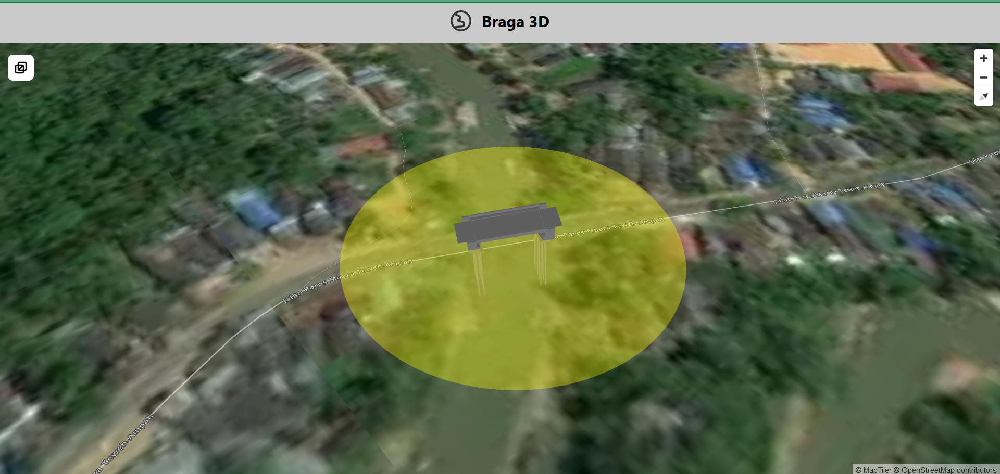
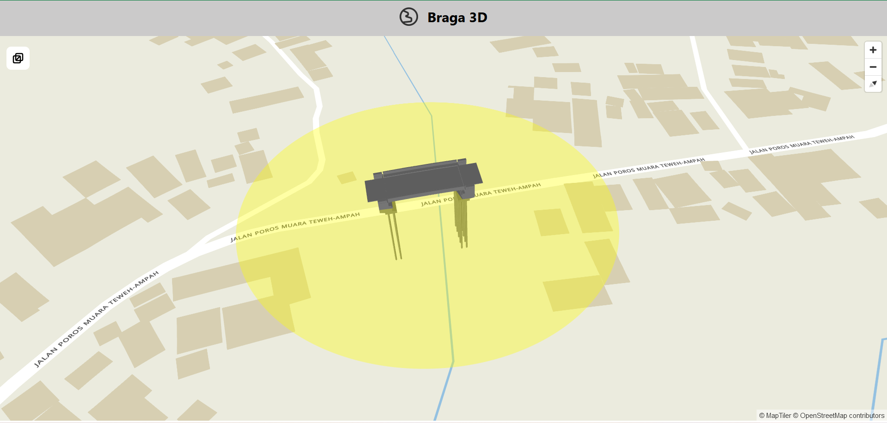

# Web-apps : Digital Twins of a building using 3d tiles approach

## Description

This is a web application for visualizing 3D building using Cesium as the host to convert 3D data into API. While, Maplibre is utilized as the main tools to visualize the map with the extention from DeckGL. In order to initiate this application there are
pre-requirements that needed to be fulfilled. The list as follows,
 

## How to

### Pre-requirements

1. Maplibre
2. DeckGL
3. Specific DeckGL-Maplibre Dependencies
4. 3d data that has been converted to 3D-tiles Cesium API
   All the dependencies details is in package.json file.

 

### Uploading data

In this case the 3D data type for the input in Cesium is .fbx then it will be translated to API with id and key of the 3D tiles store as json. Nonetheless, the other 3d data types available and upload instruction explained in this [Cesium Docs](https://cesium.com/learn/3d-tiling/tiler-data-formats/#upload-instructions). After uploading, the tiles needed to be adjusted to be referenced to a system coordinate and positioned in the correct direction. The details of instruction could be access to this [adjusted tileset cesium](https://cesium.com/learn/3d-tiling/ion-tile-set-location/). The id and key for each 3d tiles would be different thus to add or change the default 3d layer the id and key in the App.jsx file needed to be changed.

 
Eventually, you can run your code once all the pre-requirements ready by using "npm run dev".

 

## Visualization

